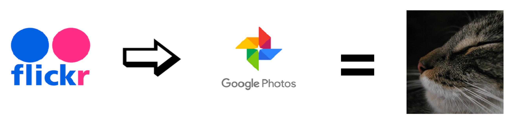

# Migrating your Flickr photo library to Google Photos



This set of scripts can help you migrate your Flickr photo collection over to Google Photos. It uses the Flickr API and 
Google API to exchange information and mirror the structure of your Flickr albums on Google Photos. The scripts are
written in Python and make use of the [python-flickr-api](https://github.com/alexis-mignon/python-flickr-api) library 
by @alexis-mignon. These scripts were built for python 3+.

### Installation
Begin by cloning this repo to your local machine:

```git clone https://github.com/llevar/flickr_to_google_photos_migration```

At this point you might want to set up and activate a virtual environment to hold the installation dependencies 
without compromising your other installs.

Go to the cloned repo and install the required libraries:

```pip install -r requirements.txt```

You now want to create some necessary directories:

```shell
mkdir auth
mkdir -p celery/out
mkdir -p celery/processed
mkdir -p celery/results 
mkdir -p photosets
mkdir -p photosets-complete
mkdir -p photosets-queue
```

### Authentication and Authorization
You now want to authenticate with the Flickr API. It's best to follow this 
[guide](https://github.com/alexis-mignon/python-flickr-api/wiki/Flickr-API-Keys-and-Authentication). You want to save 
the resulting authentication handler into ```auth/flickr_auth_handler```. The script ```build_flickr_verifier.py``` has
some helpful commands that, together with the guide above, should get you a working verifier.

You now want to set up your access to the Google Photos API. Google's [page](https://developers.google.com/photos/) 
for the API has a number of useful guides that will help you get set up. You need to set up a project and user with 
oauth2 access to your Google Photos library, so that in the end you end up with a ```google_credentials.json``` file 
that looks like this:

```json
{
  "installed": {
    "client_id": "your_id",
    "project_id": "your_project",
    "auth_uri": "https://accounts.google.com/o/oauth2/auth",
    "token_uri": "https://oauth2.googleapis.com/token",
    "auth_provider_x509_cert_url": "https://www.googleapis.com/oauth2/v1/certs",
    "client_secret": "your_secret",
    "redirect_uris": [
      "urn:ietf:wg:oauth:2.0:oob",
      "http://localhost"
    ]
  }
}
``` 

Place this file under ```auth/google_credentials.json```

Now that Google authentication is complete, setup Google authorization by running the [oauth.py](oauth.py) script:

    python oauth.py
    
An authorization server page will be opened in your default browser.  Follow the prompts to grant the migration
script access to your photos.  When successful, an additional file, ```auth/google_token.json``` will be created.

### Building a list of photos to migrate

Because one can have many thousands of photos in their library and errors may occur when communicating with either
Flickr or Google Photos, we will carry out the migration process in several steps so that it can be restarted if it fails.

The first step is to build a file containing a list of URLs and titles of all your photos, as well as the album they 
belong to. These scripts currently assume that all of your photos are stored in albums. They walk through all of your
albums and make a list of the photos in each album. If your photos are not in any albums they will not be captured by
the scripts in their current form.

We will be running the script ```build_migration_photos_list.py``` to build our list of photos. This script relies on
two environment variables ```FLICKR_API_KEY``` and ```FLICKR_API_SECRET```. These should be set in your environment 
before running the script using the values you get when you activate your Flickr API app.

```bash
export FLICKR_API_KEY=my_key
export FLICKR_API_SECRET=my_secret
python build_migration_photos_list.py
```

This script walks through all the albums and builds a list of photos that we will later use to download these photos
and upload them to Google.  If available, tags on the photo in Flickr will be used as the description of the photo in 
Google, otherwise the title in Flickr is used as the description.

To make the process restartable, we'll use Redis to record the albums that have been retrieved from Flickr.  
Fire up your own redis instance using docker:

```bash
docker run --name my-redis -p 6379:6379 --restart always --detach redis
```

For each album, a file named `photosets-queue/photoset-${album-id}-${# of photos}.pickle` will be created and an entry
will be added to Redis to record that the album has been retrieved.  If the script should fail, simply restart it.
It will skip all of the albums that have previously been downloaded.

### Creating album cache
To speed up the process of identifying albums in Google, a local cache of Google album titles will created.

```bash
python create_album_cache.py
```

This will find all of the existing albums in Google and create an entry in Redis.

### Creating migration tasks
To manage the orderly download/upload of photos between providers, and allow one to stop and resume the process we will
be using [Celery](https://github.com/celery/celery), which is a python queue-based task manager. Celery supports many
options, including different message brokers, parallelization of tasks via multiple workers and worker concurrency and
so on. We will be using Celery in a very basic configuration. Celery will be configured to use the filesystem as both a
results backend (can use a database instead, if desired) and a message broker (can use RabbitMQ, etc. instead, 
if desired). We will create a bunch of tasks and then spin up one celery worker to process them one after the other
without any parallelization. If you wish to experiment with parallel execution it is easy enough to do, but I'm not sure
what throttling rules Flickr and Google place on their APIs.

Move one or more of the pickle files in `photosets-queue/` to `photosets/` 

```bash
mv photosets-queue/*.pickle photosets/
```

and generate tasks by running:

```python create_migration_tasks.py``` 

This script will read the pickle files in ```photosets/*.pickle``` directory and create a separate Celery task for each photo.
The tasks end up as files inside the ```celery/out``` folder.  A task's job is to migrate a single photo from Flickr to Google Photos. 


### Running the migration

In order to start the actual processing of tasks you need to start celery. Do this with the following command from the 
root directory of the git repo:

```bash
celery -A celery_migration_app worker --loglevel=debug --concurrency=1 -E
```  

This starts a single worker with a concurrency of 1, meaning that only one task will be processed at a time. Celery will
grab task definitions from ```celery/out``` and process them. Processed tasks will end up in ```celerey/processed```.
The results will be stored in ```celery/results``` where 
you can look at their status. You can start and stop Celery as many times as you want and it will pick up from where it
left off. You can get a quick summary of your successes and failures by running ```python check_migration_status.py```.
After a few hours your library should hopefully be migrated over to Google Photos.

N.B. Another current limitation of the Google Photos API is that all files are uploaded in their original size, even if
you have selected the "High Quality" version of Google Photos that shouldn't count towards your Google Drive storage. 
That means that all of your photos **will** actually count towards your Google Drive capacity, and if you are not careful 
will run you out of your Google Drive space, which will cause subsequent uploads to fail. If you are on the free 
tier of Google Drive you can go to [Google Photos Settings](https://photos.google.com/settings) and choose 'Recover 
Storage' to force the conversion of all of your photos to their 'High Quality' size to reclaim the space back. The only
catch is that you can only trigger this process once per day. So if you are hurting for space (or don't want to spend
any money on a bigger storage allocation for a month) you can run migration for a while, until you start running out of 
space, stop celery, reclaim the space, then resume the migration on the next day, and so on...

N.B. #2 It looks like the Google Photos API currently has a 10000 request 
[daily limit](https://developers.google.com/photos/library/guides/api-limits-quotas). You should keep an eye on this 
and stop the migration before you hit the quota as you will otherwise get task failures.

Enjoy!

P.S. This software has been tested on Mac OS and CentOS. It will probably work on other Linux flavors.
Not sure how it will behave on Windows. There is currently very little error handling code. Your contributions are 
welcome.


##### Support on Beerpay
[](https://beerpay.io/llevar/flickr_to_google_photos_migration)
[](https://beerpay.io/llevar/flickr_to_google_photos_migration?focus=wish)
